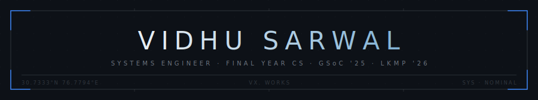
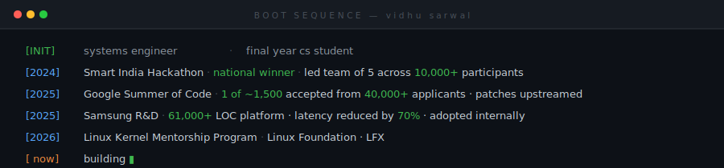

<br/>

<div align="center">

[linkedin](https://linkedin.com/in/vidhusarwal) &nbsp;·&nbsp; [portfolio](https://vidhusarwal.com)

</div>

<br/>



---

## work

**Kernel Developer Mentee** — Linux Foundation · LFX &emsp; <sub>`2026 – now`</sub>  
**Software Engineering Intern** — Google Summer of Code · BeagleBoard.org &emsp; <sub>`2025`</sub>  
**Research Intern, AI Infra** — Samsung R&D · PRISM &emsp; <sub>`2025 – 2026`</sub>  
**Engineering Intern, Embedded** — Sentinal Innovations &emsp; <sub>`2024`</sub>

---

## projects

**[VaultCrypt](https://github.com/VidhuSarwal/vaultcrypt)** &nbsp; `Go` `ChaCha20-DRBG` `AES-256-GCM`  
Zero-knowledge distributed storage — ChaCha20-DRBG sharding across cloud providers, AES-256-GCM tokens at rest, 1k+ concurrent ops at sub-500ms.

**[GitScope](https://github.com/VidhuSarwal/gitscope)** &nbsp; `Python` `Tree-sitter` `ChromaDB`  
Turns any repo into a readable narrative via Tree-sitter AST parsing, semantic search, and LLM-powered commit evolution summaries.

**[Beagle Tester Extensions](https://gist.github.com/VidhuSarwal/8e8d9dd93fea9075428cc6320c3b0a4f)** &nbsp; `C` `C++` `I2C` `Buildroot` &nbsp; — &nbsp; *GSoC '25*  
Extended Linux hardware testing framework — mikroBUS ClickID auto-detection, HDMI validation, MQTT telemetry, CI; 30% perf gain, patches accepted upstream.

---

## stack

```
systems      C · C++ · Go · Rust · Bash
ai / ml      LangGraph · ChromaDB · Tree-sitter · Qwen-VL · RAG
backend      Python · FastAPI · PostgreSQL · Redis · Docker
embedded     ESP32 · STM32 · I2C · MQTT · FreeRTOS · Buildroot
```

---

<div align="center">


&nbsp;&nbsp;


</div>

---

<div align="center">
<sub>hardware → linux → distributed systems → llms</sub>
</div>
